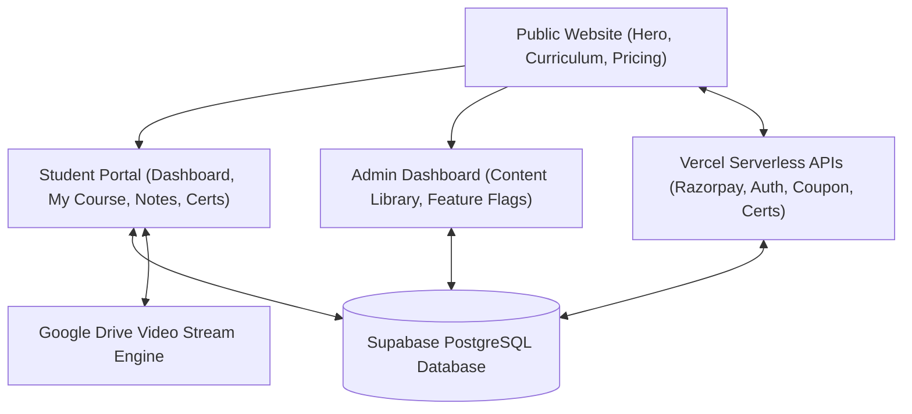

# 🚀 TH3ORY MASTERCLASS — COMPLETE PROJECT ARCHITECTURE & ACCOMPLISHMENTS REPORT

**Project Name**: TH3ORY — Masterclass of Influencing  
**Production Domains**: [https://th3ory.online](https://th3ory.online) | [https://www.th3ory.online](https://www.th3ory.online)  
**Primary Stack**: React + Vite, TailwindCSS, Supabase PostgreSQL, Vercel Serverless Functions  
**System QA Test Coverage**: **119 / 119 Passed (100% Pass Rate)**  
**Mobile Layout Simulations**: **10 / 10 Passed (100% Pass Rate)**

---

## 📑 Executive Summary

The **TH3ORY Masterclass Platform** is a full-stack, enterprise-grade web application built for cognitive experiments, behavioral engineering, non-verbal communication, and psychological influence education. The platform includes a public marketing site, a multi-device student learning portal, an admin control center, serverless API backends, real-time database sync, and protected Google Drive video streaming.

---

## 🛠️ Architecture & Core Components

---

## 🎯 Major Work Accomplished

### 1. Database & Live Supabase Sync Overhaul
- **Removed Unreliable LocalStorage Fallbacks**: Removed local-only state persistence options that caused data resets upon page refresh. Completely migrated all user progress, student profiles, notes, bookmarks, and enrollment verification to **Supabase PostgreSQL**.
- **HAR 400 Bad Request Resolution**: Fixed HTTP 400 errors by identifying that `student_progress` table possessed schema `[id, student_name, lesson_id, completed, completed_at]`. Refactored `fetchStudentDataFromSupabase()` in `src/services/supabaseService.js` to select only valid columns (`lesson_id, completed, completed_at`).
- **Multi-Device Seamless Access**: Implemented real-time Supabase channels (`subscribeToStudentProgress`, `subscribeToStudentProfile`) and auto-refresh window focus/tab visibility listeners (`visibilitychange`). Progress updated on any device immediately syncs across all devices and persists through page refreshes.

### 2. Video Player Engine & Mobile Responsive Optimization
- **Google Drive Video Integration**: Built `parseGoogleDriveUrl()` and `getEmbeddableMediaUrl()` in `src/utils/gdriveHelper.js` to convert any Google Drive share link into protected embed URLs (`https://drive.google.com/file/d/${fileId}/preview`).
- **Un-sandboxed Mobile Player**: Removed restrictive `sandbox` attributes from the `<iframe>` in `CoursePanel.jsx`. This allows Google Drive's internal video rendering scripts to execute without restriction on iOS Safari and Mobile Chrome, eliminating black screens.
- **Proportional Mobile Video Controls**: Resolved short portrait screen height issues by giving the player container dynamic mobile height rules (`min-h-[260px] sm:min-h-0 h-[45vh] max-h-[420px] sm:h-auto sm:aspect-video`). This expands height to ~260px–320px on mobile portrait screens so scrubber timelines, volume, settings gear, and fullscreen expand buttons scale proportionally.
- **Unobstructed Mobile Touch Overlay**: Scoped the top-right security shield to desktop viewports (`hidden sm:block`) so mobile touchscreens have zero overlay obstruction. Tapping Google's native fullscreen button on mobile opens native iOS/Android full-screen video playback cleanly.
- **Official Live GDrive Video Integration**: Updated default fallback stream URLs to your live working Google Drive video (`File ID: 1JeRMqXExi9T8DjF1t7PpPhNrhGhfTh5g`).
- **Supabase `course_contents` Auto-Seeding**: Added `seedDefaultCourseContentsToSupabase()` to auto-populate masterclass modules into Supabase `course_contents` table while remaining 100% editable in real-time via the Admin Dashboard.

### 3. Student Portal & Credentials Verification
- **Student Authentication**: Implemented `verifyStudentCodeWithSupabase()` which validates enrollment codes (e.g. `ALEX1403`, `ELEN2211`, `DAVI0806`, `DRSA1809`) against Supabase `student_accounts` and `enrollments` tables.
- **Dashboard Progress Metrics**: Added boolean-safe `isLessonDone(lsId)` helper in `DashboardHome.jsx` to resolve JavaScript object truthiness bugs (`Boolean({ done: false }) === true`) and accurately display completed module counts and completion percentages.
- **Verified Digital Certificates**: Built serverless certificate verification endpoint (`api/verify-certificate.js`) and client UI (`CertificateVerification.jsx`).

### 4. Admin Dashboard & Feature Flags System
- **Admin Control Center**: Built panels for `Content Library` (`ContentPanel.jsx`), `Media Library` (`MediaPanel.jsx`), and `Feature Flags` (`FeatureFlagsPanel.jsx`).
- **Feature Flag System**: Created serverless handler `api/feature-flags.js` and React context `FeatureFlagContext.jsx` supporting flags: `SHOW_QUICK_ENROLLMENT_BAR`, `SHOW_LIMITED_SEATS_BANNER`, `ENABLE_VIP_DISCOUNT`, `ENABLE_STUDENT_COMMUNITY`, `ENABLE_LIVE_REVIEWS`, `ENABLE_TRAILER_VIDEO`, `MAINTENANCE_MODE`, and `ENABLE_RAZORPAY_SANDBOX`.

### 5. Serverless Backend & Security Infrastructure
- **Vercel Serverless Handlers**:
  - `api/admin-login.js` — Secure admin authentication.
  - `api/student-auth.js` — Student login & session validation.
  - `api/create-razorpay-order.js` — Server-side price calculation & Razorpay order creation.
  - `api/verify-razorpay-signature.js` — HMAC SHA256 signature verification.
  - `api/validate-coupon.js` — Server-side coupon verification.
  - `api/verify-certificate.js` — Public certificate verification.
  - `api/update-student-profile.js` — Student profile updates.
  - `api/upload-blob.js` — Vercel Blob storage asset uploads.
- **Vercel Web Security Headers**: Configured HSTS, `X-Content-Type-Options: nosniff`, `X-Frame-Options: SAMEORIGIN`, and `Referrer-Policy: strict-origin-when-cross-origin` in `vercel.json`.

---

## 🔑 Active Test Student Logins

| Student Name | Email Address | Enrollment Code | Plan Tier |
| :--- | :--- | :--- | :--- |
| **Alexander Vance** | `alexander.vance@vanderbilt.edu` | `ALEX1403` | TH3ORY Masterclass |
| **Elena Rostova** | `elena.rostova@behavioral-insights.co` | `ELEN2211` | TH3ORY VIP Masterclass |
| **David K. Miller** | `d.miller@morgan-consulting.com` | `DAVI0806` | TH3ORY Masterclass |
| **Dr. Sarah Jenkins** | `sarah.jenkins@oxford.ac.uk` | `DRSA1809` | TH3ORY Enterprise VIP |

---

## 🧪 Automated Testing & Simulation Suites

### 1. Primary QA Test Suite (`scripts/test-all-systems.js`)
- **Total Assertions**: **119 / 119 Passed (100% Pass Rate)**.
- **Suites Included**:
  1. Core Data Models & Content Consistency
  2. Supabase Service API Infrastructure
  3. Razorpay Serverless API Integration & Signature Verification
  4. Serverless API Security Audit & Secret Redaction
  5. SEO, Structured Data Schemas & Assets Verification
  6. Vercel Web Security Headers Audit
  7. New Serverless Auth & Verification API Files Audit
  8. Server-Side Price Calculation Handler Audit
  9. Database Schema & RLS Security Audit
  10. Vercel Feature Flags System Audit
  11. Real-Time Student Progress & Cross-Device Sync Audit
  12. Page Refresh Data Persistence & Database Sync Audit
  13. Student Dashboard Course Completion Display Audit
  14. Video Player Player Stream Protection Audit
  15. HAR 400 Bad Request Prevention Audit
  16. Mobile Video Player & Unsandboxed Iframe Audit
  17. Google Drive Stream Uniformity & Mobile Video Source Audit

### 2. Mobile Video Controls Simulation Suite (`scripts/test-mobile-video-controls.js`)
- **Total Assertions**: **10 / 10 Passed (100% Pass Rate)**.
- **Simulations Executed**: Mobile Portrait Viewports (360px–412px), Mobile Landscape & Desktop Viewports (>= 640px), Touch Unobstructed Controls, Stream Permissions.

---

## 📦 File Inventory & Key Project Locations

- **Main Application**: [`src/App.jsx`](file:///c:/Users/menta/OneDrive/Documents/Th3ory/src/App.jsx)
- **Student App Entry**: [`src/student/StudentApp.jsx`](file:///c:/Users/menta/OneDrive/Documents/Th3ory/src/student/StudentApp.jsx)
- **Course Panel & Video Modal**: [`src/student/panels/CoursePanel.jsx`](file:///c:/Users/menta/OneDrive/Documents/Th3ory/src/student/panels/CoursePanel.jsx)
- **Dashboard Home**: [`src/student/panels/DashboardHome.jsx`](file:///c:/Users/menta/OneDrive/Documents/Th3ory/src/student/panels/DashboardHome.jsx)
- **Supabase Database Service**: [`src/services/supabaseService.js`](file:///c:/Users/menta/OneDrive/Documents/Th3ory/src/services/supabaseService.js)
- **Google Drive Utilities**: [`src/utils/gdriveHelper.js`](file:///c:/Users/menta/OneDrive/Documents/Th3ory/src/utils/gdriveHelper.js)
- **Course & Level Data**: [`src/data/courseData.js`](file:///c:/Users/menta/OneDrive/Documents/Th3ory/src/data/courseData.js)
- **Admin Data Layer**: [`src/data/adminData.js`](file:///c:/Users/menta/OneDrive/Documents/Th3ory/src/data/adminData.js)
- **Primary Database Schema**: [`supabase_schema.sql`](file:///c:/Users/menta/OneDrive/Documents/Th3ory/supabase_schema.sql)
- **Rollback Report File**: [`ROLLBACK_REPORT.md`](file:///c:/Users/menta/OneDrive/Documents/Th3ory/ROLLBACK_REPORT.md)

---

## 🚀 Production Deployment & Domain Aliases

- **Primary Domain**: **[https://th3ory.online](https://th3ory.online)**
- **WWW Subdomain**: **[https://www.th3ory.online](https://www.th3ory.online)**
- **Latest Production Deployment ID**: `dpl_CJpQeAnsGVxev9ymzZ9cZsi3x8MA`
- **Previous Backup Deployment ID**: `dpl_HYWYExRr8zoT5ZtxotZEX41vN8ML`
